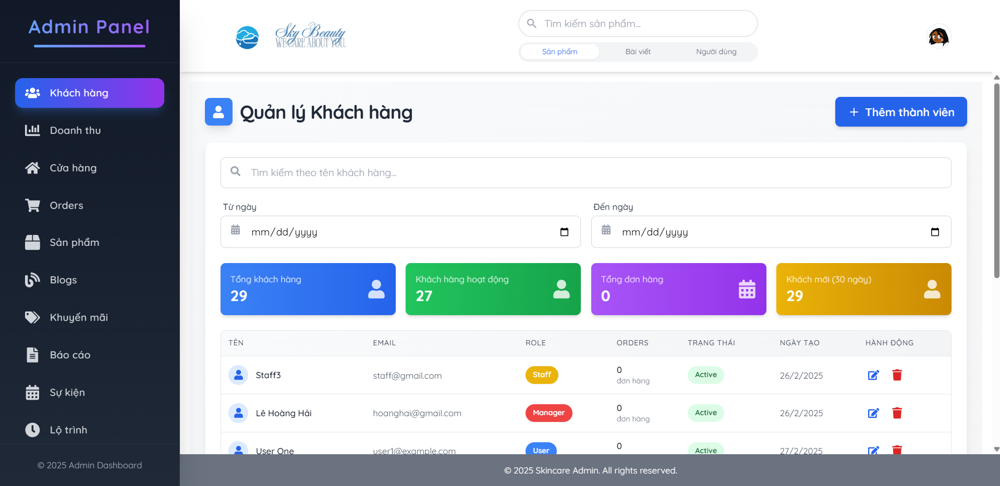

<div align="center">
     <picture>
    
  </picture>
</div>

<h1 align="center"> E-commerce Cometics Platform 🌿</h1>

BeatySkyShop is a modern e-commerce platform designed for a skincare company, allowing users to explore products, read blogs, determine their skin type, find suitable skincare regimens, and make informed purchases.

## 🌐 Live Demo

- Website URL: `<YOUR_FRONTEND_DEPLOYMENT_URL>`
- API Documentation: `<API_DOCS_URL>`

## Preview 📸
<div align="center">
  <h3>Home Page</h3>
  
  <p><em></em></p>

  <h3>Product Interface</h3>
  
  <p><em></em></p>

  <h3>Dashboard</h3>
  
  <p><em></em></p>
</div>


## ✨ Key Features

- Interactive homepage introducing the company and skincare products
- Blog and news sharing platform
- Skin type assessment via a quiz
- Personalized skincare regimen recommendations
- Smart product recommendations based on skin type
- Product comparison feature
- Order management from placement to completion
- Payment and cancellation policy management
- Promotions by period
- Customer ratings and feedback system
- User profile and order history management
- Admin Dashboard & Reports

## 🛠 Tech Stack

- **Frontend Framework:** React.js (Vite)
- **Styling:** Tailwind CSS
- **State Management:** ` Context API`
- **Routing:** React Router
- **API Calls:** Axios
- **Authentication:** JWT-based authentication

## 🚀 Getting Started

### Prerequisites

- Node.js (v16 or higher)
- npm or yarn

### Installation

1. Clone the repository:

   ```bash
   git clone https://github.com/huynhtoan3152004/BeautySky-FE.git
   ```

2. Navigate to the project directory:

   ```bash
   cd beautyskyshop-frontend
   ```

3. Install dependencies:

   ```bash
   npm install
   ```

4. Configure environment variables:

   ```bash
   cp .env.example .env
   ```
   ```bash 
   VITE_API_KEY = <Your localhost BE>
   ```

   Update the `.env` file with your API base URL and other settings.

5. Start the development server:

   ```bash
   npm run dev
   ```

   The frontend will be available at `http://localhost:5173`

## 👥 Contributing

1. Fork the repository
2. Create your feature branch: `git checkout -b feature/amazing-feature`
3. Commit your changes: `git commit -m 'Add some amazing feature'`
4. Push to the branch: `git push origin feature/amazing-feature`

## 📄 License

This project is licensed under the MIT License - see the [LICENSE.md](LICENSE.md) file for details.

## 🤝 Support

For support and queries:

- Email: `haile170504@gmail.com`
- Email: `huynhhuutoanwork@gmail.com`
- Email: `danhthanh18102004@gmail.com`
- Email: `uyennhi01022004@gmail.com`                                                            

## 🙏 Acknowledgments

- Thanks to all contributors who have helped with the API development
- Special thanks to our lecturer [Nguyen The Hoang](https://github.com/doit-now) for guidance
- Appreciation to the open-source community for the amazing tools and libraries
##
<div align="center">
  Made with ❤️ by    the BeautySky Team
</div>
    